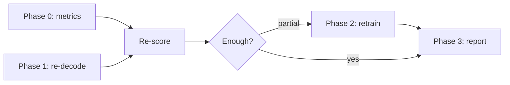

# Fix Plan

#status/in-progress

Phased plan from June 2026 discussion. Full Cursor plan: `.cursor/plans/hebrew_summarization_fixes_6d7e5cc1.plan.md`

> **2026-06-27 implementation status:** all *code* changes for Phases 0–2 are done and merged.
> Phase 0 (metrics) is live now. Phases 1–2 need their HuggingFace Jobs runs (and a local
> `data.preprocess` re-run for the new prompt) before re-scoring. Phase 3 numbers wait on those runs.
> Deviation: no standalone `redecode_hf_job.py` — the repo's existing `train.py --submit-hf
> --inference-only` already re-decodes the pushed adapter, so the fixed decode config went into the
> shared generation path (`train_hf_job.py` + `infer.py`) instead, with a `--pred-suffix -v2` knob.

**Constraint:** all GPU work on HuggingFace Jobs; local = metrics, API, pytest only.

---

## Phase 0 — Hebrew-aware evaluation (local, free)

#status/done

| Task | File |
|------|------|
| AlephBERT BERTScore default | `evaluation/evaluate.py` → `onlplab/alephbert-base` |
| Raw + normalized ROUGE | `evaluation/evaluate.py` |
| Re-score existing predictions | `outputs/results/*.jsonl` |

No model load required (BERTScore on CPU).

---

## Phase 1 — Re-decode existing adapter (HF Jobs, no retrain)

#status/done

**Result (2026-06-27, job `6a3f8e18…`):** decoding alone is **not enough** → gate says go to Phase 2.
Re-decoding the v1 adapter with the anti-degeneration config removed the repetition loops but **lowered
every metric** (ROUGE-1 11.4→4.7, AlephBERT BERTScore 0.45→0.38): the loops were masking an undertrained
model, which now hallucinates fluent gibberish. Full table + reading in [[Current Results#Phase 1 — decoding-only re-decode (2026-06-27)]].

**Goal:** measure decoding-only fix on `avreymi/amlk-qwen3-2b-sft`.

| Task | Detail |
|------|--------|
| Vehicle | existing `train.py --submit-hf --inference-only` (no new script) |
| Keep OLD prompt | uses the dataset's precomputed `prompt` column (v1 template) |
| Decode settings | shared `train_hf_job.py`/`infer.py` — see [[Decoding Configuration]] |
| Base baseline | `strip_think` applied at scoring time (`evaluate.py`) |
| Outputs | `--pred-suffix -v2` → `predictions-{finetuned,base}-v2.jsonl` on Hub |

Run: `python -m training.train --submit-hf --hf-user avreymi --inference-only --pred-suffix -v2`.
Then download + score with the Phase 0 metrics and compare v2 vs [[Current Results]].

---

## Phase 2 — Retrain (HF Jobs)

#status/code-done #status/run-pending

| Change | File | State |
|--------|------|-------|
| `EPOCHS` env (`--epochs`), default **3** | `training/train.py`, `training/train_hf_job.py` | done |
| LoRA: +MLP (`gate/up/down_proj`), `r=32`/`alpha=64` | `training/config.py`, `train_hf_job.py` | done |
| EOS on completions | TRL auto-appends it under `completion_only_loss` (verified) | done |
| Prompt: "up to 3 sentences" | `data/prompts.py` | done — **re-preprocess + re-upload pending** |
| `load_best_model_at_end` on `eval_loss` | `train_hf_job.py` | done |
| Fixed decode at inference | shared generate path | done |

Re-run `data.preprocess --variant whole` (needs a datasets-working env; local is missing `_lzma`),
then smoke-test (`--smoke-test`) and the full run (`--submit-hf`).

---

## Phase 3 — Reporting

#status/planned

- Table next to HeSum Table 3 (mLongT5 17.5, GPT-4 13.6)
- Lead with AlephBERT + judge; ROUGE secondary + HeSum negative-correlation caveat
- Report lead-copying rate ([[Lead Bias Probe]])
- Update `AGENTS.md`, `README.md`, `TODO.md` (B'.1, B'.2, D.1)

---

## Out of scope / blockers

- **Gemini baseline:** GCP billing 403 — fix billing, not code
- **Generator tokenizer swap:** not worth it on Qwen3
- **ROUGE early stopping during train:** expensive; try `eval_loss` checkpointing first

## Team decisions (locked)

- Sequence: **re-decode first**, then retrain if needed
- Prompt: **keep raw E-H-H**, add length cap in Phase 2 only

Related: [[Home]], [[Training Objective]], [[Decoding Configuration]]
