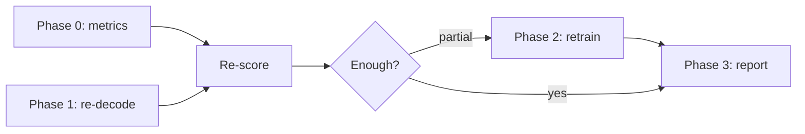

# Fix Plan

#status/planned

Phased plan from June 2026 discussion. Full Cursor plan: `.cursor/plans/hebrew_summarization_fixes_6d7e5cc1.plan.md`

**Constraint:** all GPU work on HuggingFace Jobs; local = metrics, API, pytest only.

---

## Phase 0 — Hebrew-aware evaluation (local, free)

#status/planned

| Task | File |
|------|------|
| AlephBERT BERTScore default | `evaluation/evaluate.py` → `onlplab/alephbert-base` |
| Raw + normalized ROUGE | `evaluation/evaluate.py` |
| Re-score existing predictions | `outputs/results/*.jsonl` |

No model load required (BERTScore on CPU).

---

## Phase 1 — Re-decode existing adapter (HF Jobs, no retrain)

#status/planned

**Goal:** measure decoding-only fix on `avreymi/amlk-qwen3-2b-sft`.

| Task | Detail |
|------|--------|
| New script | `evaluation/redecode_hf_job.py` (PEP 723 UV, self-contained) |
| Keep OLD prompt | Adapter trained on current `data/prompts.py` template |
| Decode settings | See [[Decoding Configuration]] |
| Base baseline | Strip `<think>` from Qwen3 output |
| Outputs | `predictions-finetuned-v2.jsonl`, `predictions-base-v2.jsonl` on Hub |

Compare v2 vs [[Current Results]] → if clean rate jumps, retrain is smaller scope.

---

## Phase 2 — Retrain (HF Jobs)

#status/planned

| Change | File |
|--------|------|
| `EPOCHS` env, default **3** | `training/train.py`, `training/train_hf_job.py` |
| LoRA: +MLP modules, `r=32` | `training/config.py`, `train_hf_job.py` |
| EOS on completions | verify TRL `completion_only_loss` |
| Prompt: “up to 3 sentences” | `data/prompts.py` → re-preprocess → re-upload dataset |
| `load_best_model_at_end` on `eval_loss` | **recommended add** — `train_hf_job.py` |
| Fixed decode at inference | `train_hf_job.py` post-train generate |

Smoke-test (`--smoke-test`) before full run.

---

## Phase 3 — Reporting

#status/planned

- Table next to HeSum Table 3 (mLongT5 17.5, GPT-4 13.6)
- Lead with AlephBERT + judge; ROUGE secondary + HeSum negative-correlation caveat
- Report lead-copying rate ([[Lead Bias Probe]])
- Update `AGENTS.md`, `README.md`, `TODO.md` (B'.1, B'.2, D.1)

---

## Out of scope / blockers

- **Gemini baseline:** GCP billing 403 — fix billing, not code
- **Generator tokenizer swap:** not worth it on Qwen3
- **ROUGE early stopping during train:** expensive; try `eval_loss` checkpointing first

## Team decisions (locked)

- Sequence: **re-decode first**, then retrain if needed
- Prompt: **keep raw E-H-H**, add length cap in Phase 2 only

Related: [[Home]], [[Training Objective]], [[Decoding Configuration]]
